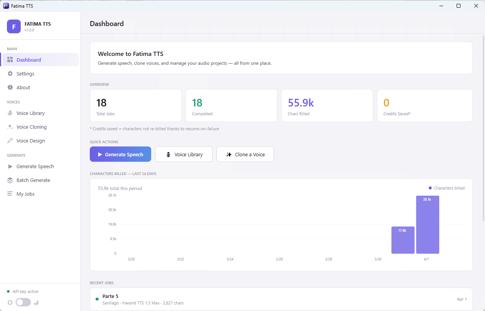

# Fatima TTS

> Windows-native desktop client for the [Inworld TTS API](https://docs.inworld.ai/docs/tts/tts.md) — no timeouts, no lost credits, full resume-on-failure support.



## Why?

The web-based Inworld TTS workflow has a critical flaw: PHP's request timeout ceiling means long jobs silently fail mid-way through, burning API credits for audio you never receive. Fatima TTS eliminates this entirely by running as a native Windows process with no timeout ceiling, per-chunk retry logic, and the ability to resume interrupted jobs from exactly where they left off.

| PHP Problem | Fatima TTS Solution |
|---|---|
| Web server timeout (30–120s) | No timeout — runs as long as needed |
| Silent failure, no visibility | Per-chunk status tracked live in UI |
| Full re-bill on retry | Resume from failed chunk only |
| Internet hiccup kills whole job | Per-chunk retry with backoff |
| Credits wasted on partial jobs | Job only marked complete when all chunks succeed |

## Features

- **Generate Speech** — large text input with live character counter, job title, chunked synthesis with per-chunk progress
- **Batch Generate** — CSV/TXT file upload or manual queue entry, sequential output naming (`01-Hook.mp3`, `02-Parte 1.mp3`), FFmpeg merge option
- **My Jobs** — full history with waveform player bar, seek, SRT export, resume interrupted jobs
- **Batch Detail** — dedicated page per batch showing all jobs, status, play/save per job
- **Voice Library** — browse all voices, preview, filter by type (system/cloned)
- **Voice Cloning** — upload audio samples, submit to Inworld clone API
- **Voice Design** — describe a voice in text, generate 3 previews, publish to library
- **Dashboard** — stats overview, 14-day usage chart, recent jobs
- **SRT Export** — word-level subtitle files saved automatically alongside audio
- **FFmpeg Integration** — auto-downloaded and managed, batch merge without quality loss
- **Dark/Light theme** — persisted preference
- **Windows toast notifications** — background job completion alerts
- **Per-chunk resume** — if a job fails at chunk 14 of 30, only chunks 14–30 are retried

## Requirements

- Windows 10 or 11 (x64)
- [Inworld API key](https://platform.inworld.ai/)
- FFmpeg is auto-downloaded on first use (optional — only needed for batch merge)

## Installation

### Option 1 — Installer (recommended)
Download `FatimaTTS-v1.0.0-installer.msi` from the [latest release](https://github.com/YOUR_GITHUB_USERNAME/fatima-tts/releases/latest) and run it.

### Option 2 — Portable EXE
Download `FatimaTTS-v1.0.0-win-x64.exe` from [releases](https://github.com/YOUR_GITHUB_USERNAME/fatima-tts/releases/latest) and run directly — no installation needed.

## Building from source

```bash
git clone https://github.com/YOUR_GITHUB_USERNAME/fatima-tts.git
cd fatima-tts
dotnet restore FatimaTTS/FatimaTTS.csproj
dotnet run --project FatimaTTS/FatimaTTS.csproj
```

### Publish self-contained exe

```bash
dotnet publish FatimaTTS/FatimaTTS.csproj \
  -c Release -r win-x64 --self-contained true \
  -p:PublishSingleFile=true \
  -p:IncludeNativeLibrariesForSelfExtract=true \
  -o publish/
```

### Build MSI installer

```bash
dotnet tool install -g wix
cd installer
wix build FatimaTTS.wxs -o FatimaTTS-installer.msi
```

## Configuration

On first launch, go to **Settings** and enter your Inworld API key. It is stored securely using Windows DPAPI (Credential Manager) — never written to disk in plaintext.

## Logs

Application logs are saved to:
```
%AppData%\FatimaTTS\logs\fatima_YYYY-MM-DD.log
```
Logs rotate daily and are pruned after 30 days.

## Tech Stack

- **WPF / .NET 8** — Windows Presentation Foundation, C#
- **NAudio** — audio playback and waveform extraction
- **Inworld TTS API** — synthesis, voice library, cloning, design
- **FFmpeg** — batch audio merging (auto-managed)
- **Windows DPAPI** — secure API key storage

## License

MIT — see [LICENSE](LICENSE)

## Contributing

Pull requests welcome. Please open an issue first to discuss significant changes.
